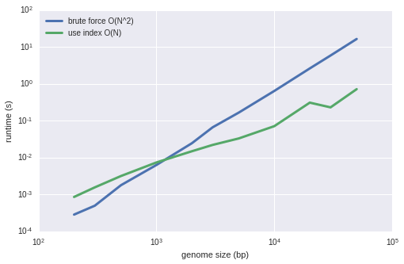

# denovo
a toy de novo assembly algorithm

This can be run either from the command line or it can be imported into an ipython notebook.

### Command Line
To use via the command line you can just run

    python denovo.py inputfile [outputfile (optional)]

with two arguments it saves it to file

### Importing as a module
Alternatively, you can use `import denovo` to import all the subroutines into python and run individually

`denovo.assemble(filename)` returns the sequence based on the reads in the file.  
Or you can use `denovo.assemble(filename,1)` for a faster version (see below)

The subroutines are:

1. readFastaReads(filename) - loads reads from file in example format
2. overlap(a,b,overlap_n) - finds the largest region where two reads overlap provided the overlap is at least overlap_n long
3. overlap_all_pairs_easy(reads) - runs overlap on all pairs of reads
4. overlap_all_pairs_tricky(reads) - runs overlap on pairs of reads after checking index (see more below)
5. make_kmer(reads,k) - make k-mer index for overlap_all_pairs_tricky
6. conjoiner(reads) - uses the overlap_all_pairs results to stitch reads together

# Brute Force vs Indexed approach
I wanted to compare the brute force answer with a technique I learned about in the Coursera course for Genomic Algorithms.

The brute force algorithm compares every pair of sequences to find overlaps
The indexed algorithm first builds an index so that you only need to compare to the most relevant sequence.

You can check out [my ipython notebook](denovo_testing.ipynb) where I compare the performance of both on larger and larger example genomes.

Hope you enjoy it!
